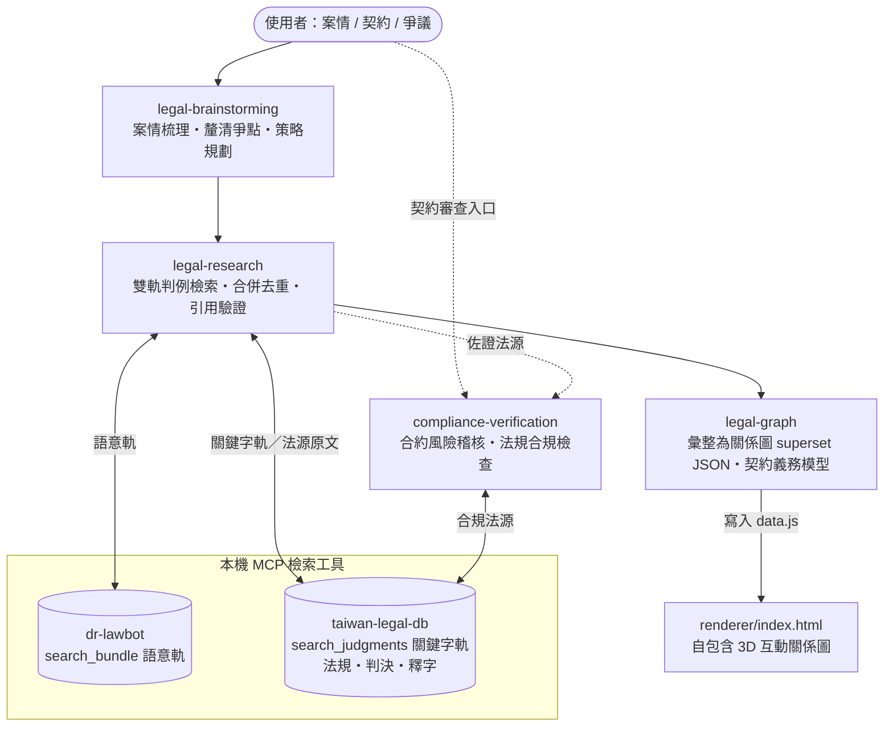

# 台灣法律技能包 (law-powers)

本專案是一個為台灣法律工作者與法務人員量身打造的 AI 超能力技能包（基於 Antigravity/Gemini-Agent 框架）。透過精細配置的系統技能與工作流提示，使您的 AI 助理具備嚴謹的台灣法律思維、防幻覺信任閘門，並能無縫調用本機的法律檢索工具。

## 核心特色
1. **防幻覺信任閘門 (Trust Gates)**：強制 AI 助理必須先檢索法源（法規、判例）才回答，無據則不臆測。
2. **嚴格引用驗證 (Citation Verification)**：所有回答均附上法規條項或司法院裁判字號。
3. **台灣法治在地化**：完全使用中華民國法律術語，並融入台灣民法、勞基法、個資法、公司法的合規審查邏輯。

## 前置配置要求

本技能包為 Prompt-Only 輕量化架構，檢索功能高度依賴於本機運行的 **台灣法規判例 MCP Server**。

請確保您的環境中已安裝並登錄以下 MCP Server：
*   **MCP 專案名稱**：`taiwan-legal-db`
*   **GitHub**：[mcp-taiwan-legal-db](https://github.com/lawchat-oss/mcp-taiwan-legal-db)
*   **安裝指令**：
    ```bash
    # 一般環境（含 Windows）：
    pip install mcp-taiwan-legal-db
    # Debian/Ubuntu/WSL 建議以 pipx 隔離安裝：
    pipx install mcp-taiwan-legal-db
    ```
*   **MCP 註冊方式（依你的工具而定）**：
    *   **Claude Code（CLI／VSCode 擴充，本專案主要環境）**——使用官方指令註冊即可，無須手動編輯設定檔：
        ```bash
        claude mcp add taiwan-legal-db mcp-taiwan-legal-db --scope user
        ```
    *   **Claude Desktop／Gemini IDE**——手動在 MCP 設定檔的 `mcpServers` 中加入：
        ```json
        {
          "mcpServers": {
            "taiwan-legal-db": {
              "command": "mcp-taiwan-legal-db"
            }
          }
        }
        ```

### 語意判例檢索引擎（dr-lawbot，雙軌檢索之語意軌；未安裝時降級為關鍵字單軌）

從案情尋找相關判例與裁判論理時，`legal-research` 預設在同一回合並行執行兩條檢索路徑：

*   **語意軌（重召回）**：`dr-lawbot:search_bundle`（`search_type=hybrid`、`read_top=3`），使用自然語言案情搜尋相關判例。`dr-lawbot` 是開源專案 [tw-legal-rag](https://github.com/aa0101181514/tw-legal-rag) 的官方 Remote MCP 介面，連線約 2,200 萬筆台灣裁判。
*   **關鍵字軌（重精確）**：先將口語案情轉換成台灣法律專業用語，再呼叫 `taiwan-legal-db:search_judgments`。

兩軌結果會優先以司法院 JID 合併去重；同一判決若兩軌皆命中，會優先排序。若 `dr-lawbot` 未安裝或暫時無法使用，技能不會中止，而會降級為 `taiwan-legal-db:search_judgments` 關鍵字單軌，並提示語意檢索未啟用。已知確切案號或需要依法院、年度、案類精確過濾時，則直接使用關鍵字／結構化檢索，不必啟動雙軌。

*   **Claude Code**：

    ```bash
    claude mcp add --transport http dr-lawbot https://tlr.dr-lawbot.com/mcp --scope user
    ```

*   **Claude Desktop／Gemini IDE**：於 MCP 設定檔 `mcpServers` 內加入：

    ```json
    {
      "mcpServers": {
        "dr-lawbot": { "type": "http", "url": "https://tlr.dr-lawbot.com/mcp" }
      }
    }
    ```

## 技能關係圖 (Skill Map)



> 訴訟／爭議走 `legal-brainstorming → legal-research → legal-graph` 主線；契約／合規案件可直接進 `compliance-verification`。判例檢索預設同時執行語意軌與關鍵字軌，再合併去重；兩條業務路徑均受引用驗證與廢棄判決防護約束（防幻覺）。

## 技能列表 (Skills)
*   **`legal-brainstorming`**：案情分析與訴訟策略起草前腦力激盪。
*   **`legal-research`**：以語意與關鍵字雙軌並行檢索台灣判例，合併去重後執行引用驗證、廢棄判決防護與信任閘門。
*   **`legal-graph`**：將案情、法條、判決、爭點、當事人、證據，以及 `contract → clause → obligation` 契約義務三層模型與風險評級彙整為 superset 法律關係圖資料；隨附自包含 3D 渲染器（`skills/legal-graph/renderer/`）可直接檢視。
*   **`compliance-verification`**：進行合約風險稽核與特定法規合規性檢查。

### 建議串接流程（端到端）

1. **`legal-brainstorming`**：逐步梳理案情、法律關係與爭點。
2. **`legal-research`**：同一回合並行呼叫 `dr-lawbot:search_bundle`（語意）與 `taiwan-legal-db:search_judgments`（法律關鍵字），依 JID 合併去重後執行引用驗證與廢棄判決防護；法條原文另由 `taiwan-legal-db` 查證。
3. **`legal-graph`**：將事實、法條、判決、爭點、當事人與證據整理為 superset JSON；契約案件另建立 `contract → clause → obligation` 三層結構並對映合規審查風險，被上級審廢棄的判決標記 `overturned`。
4. **檢視關係圖**：依下方「輸出路徑」將 `{nodes, edges}` 寫入對應的 `data.js`，再以瀏覽器開啟同一組的 `index.html`，即可自動載入互動式法律關係圖。已廢棄判決會以紅框虛線標示。

### legal-graph 輸出路徑

`legal-graph` 支援完整開發專案與 skills-only 發布包兩種目錄配置，請勿混用：

| 使用方式 | 資料檔 | 開啟頁面 |
|---|---|---|
| 完整 `law-powers` 開發專案 | 專案根目錄 `data.js` | 專案根目錄 `index.html` |
| GitHub skills-only 發布包／全域安裝技能 | 相對於 `legal-graph` 技能目錄的 `renderer/data.js` | 同目錄的 `renderer/index.html` |

公開 GitHub repo 隨附的 `skills/legal-graph/renderer/data.js` 是虛構示範資料，可直接開啟預覽；實際產圖時應保留 `window.GRAPH_DATA = { "nodes": [...], "edges": [...] };` 格式並以新資料取代示範內容。
