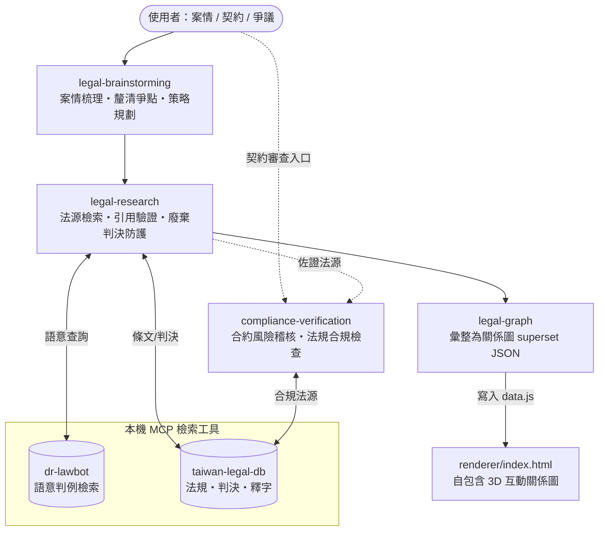

# 台灣法律技能包 (law-powers)

本專案是一個為台灣法律工作者與法務人員量身打造的 AI 超能力技能包（基於 Antigravity/Gemini-Agent 框架）。透過精細配置的系統技能與工作流提示，使您的 AI 助理具備嚴謹的台灣法律思維、防幻覺信任閘門，並能無縫調用本機的法律檢索工具。

## 核心特色
1. **防幻覺信任閘門 (Trust Gates)**：強制 AI 助理必須先檢索法源（法規、判例）才回答，無據則不臆測。
2. **嚴格引用驗證 (Citation Verification)**：所有回答均附上法規條項或司法院裁判字號。
3. **台灣法治在地化**：完全使用中華民國法律術語，並融入台灣民法、勞基法、個資法、公司法的合規審查邏輯。

## 前置配置要求

本技能包為 Prompt-Only 輕量化架構，檢索功能高度依賴於本機運行的 **台灣法規判例 MCP Server**。

請確保您的環境中已安裝並登錄以下 MCP Server：
*   **MCP 專案名稱**：`taiwan-legal-db`
*   **GitHub**：[mcp-taiwan-legal-db](https://github.com/lawchat-oss/mcp-taiwan-legal-db)
*   **安裝指令**：
    ```bash
    # 一般環境（含 Windows）：
    pip install mcp-taiwan-legal-db
    # Debian/Ubuntu/WSL 建議以 pipx 隔離安裝：
    pipx install mcp-taiwan-legal-db
    ```
*   **MCP 註冊方式（依你的工具而定）**：
    *   **Claude Code（CLI／VSCode 擴充，本專案主要環境）**——使用官方指令註冊即可，無須手動編輯設定檔：
        ```bash
        claude mcp add taiwan-legal-db mcp-taiwan-legal-db --scope user
        ```
    *   **Claude Desktop／Gemini IDE**——手動在 MCP 設定檔的 `mcpServers` 中加入：
        ```json
        {
          "mcpServers": {
            "taiwan-legal-db": {
              "command": "mcp-taiwan-legal-db"
            }
          }
        }
        ```

### 語意判例檢索引擎（dr-lawbot，預設引擎；未安裝可降級）

判例的語意檢索預設走 `dr-lawbot` Remote MCP（開源專案 [tw-legal-rag](https://github.com/aa0101181514/tw-legal-rag) 的官方託管介面，連線約 2,200 萬筆台灣裁判）。未安裝時技能會退回關鍵字檢索，但相關判例的檢索涵蓋較差。

*   **Claude Code**：

    ```bash
    claude mcp add --transport http dr-lawbot https://tlr.dr-lawbot.com/mcp --scope user
    ```

*   **Claude Desktop／Gemini IDE**：於 MCP 設定檔 `mcpServers` 內加入：

    ```json
    {
      "mcpServers": {
        "dr-lawbot": { "type": "http", "url": "https://tlr.dr-lawbot.com/mcp" }
      }
    }
    ```

## 技能關係圖 (Skill Map)



> 訴訟／爭議走 `legal-brainstorming → legal-research → legal-graph` 主線；契約／合規案件可直接進 `compliance-verification`。兩條路徑的法源檢索都以本機 MCP 工具為後盾，並受引用驗證與廢棄判決防護約束（防幻覺）。

## 技能列表 (Skills)
*   **`legal-brainstorming`**：案情分析與訴訟策略起草前腦力激盪。
*   **`legal-research`**：指導 Agent 精準檢索台灣司法院判決與全國法規。
*   **`legal-graph`**：將案情、法條、判決、爭點彙整為法律關係圖 JSON，並隨附自包含 3D 渲染器（`skills/legal-graph/renderer/`）可直接檢視。
*   **`compliance-verification`**：進行合約風險稽核與特定法規合規性檢查。

### 建議串接流程（端到端）

1. **`legal-brainstorming`**：逐步梳理案情、法律關係與爭點。
2. **`legal-research`**：以 `dr-lawbot:search_bundle`（語意）找相關判例、`taiwan-legal-db` 查法條，並執行引用驗證與廢棄判決防護。
3. **`legal-graph`**：將事實、法條、判決、爭點整理為標準 JSON（被廢棄判決標 `overturned`）。
4. **檢視關係圖**：`legal-graph` 會將 JSON 寫入 `skills/legal-graph/renderer/data.js`；以瀏覽器開啟同目錄的自包含 `renderer/index.html` 即自動載入渲染互動式法律關係圖（已廢棄判決會以紅框虛線標示）。附帶的 `data.js` 為虛構示範資料，可直接開啟預覽。
