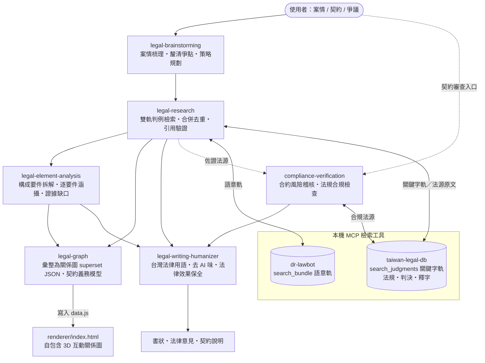
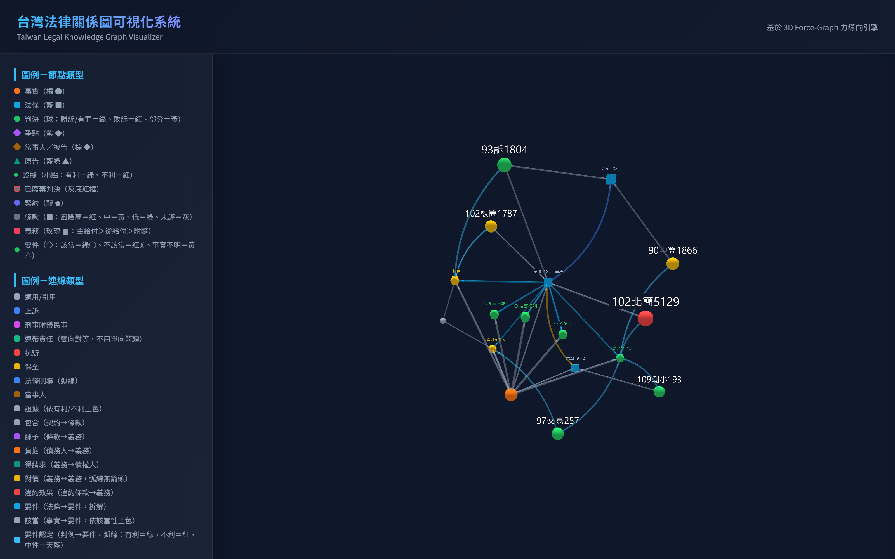

# 台灣法律技能包 (law-powers)

> **Law is Code. Evidence is the Gate.**
>
> 當 AI 參與法律攻防，提示詞、工具與信任閘門就是約束它的規則；規則要求查證，它才不能靠猜測完成答案。

[🌐 查看宣傳網站](https://kevintsai1202.github.io/law-powers/) · [閱讀完整宣傳文宣](docs/promo-copy.md)

本專案是一個為台灣法律工作者與法務人員量身打造的 AI 超能力技能包（基於 Antigravity/Gemini-Agent 框架）。透過精細配置的系統技能與工作流提示，使您的 AI 助理具備嚴謹的台灣法律思維、防幻覺信任閘門，並能無縫調用本機的法律檢索工具。

## 安裝技能包

建議使用 `npx skills add`（[Skills CLI](https://skills.sh/)）一次將全部 7 個技能安裝到使用者層級，並套用至系統偵測到的所有支援 Agent：

```powershell
npx skills add kevintsai1202/law-powers -g --all
```

若要自行選擇安裝的技能、Agent 與範圍，請改用互動模式：

```powershell
npx skills add kevintsai1202/law-powers
```

> 技能安裝完成後，仍需依下方「前置配置要求」設定 `taiwan-legal-db` 與 `dr-lawbot`，才能啟用法規、判決及語意判例檢索。

## 核心特色
1. **防幻覺信任閘門 (Trust Gates)**：強制 AI 助理必須先檢索法源（法規、判例）才回答，無據則不臆測。
2. **嚴格引用驗證 (Citation Verification)**：所有回答均附上法規條項或司法院裁判字號。
3. **台灣法治在地化**：完全使用中華民國法律術語，並融入台灣民法、勞基法、個資法、公司法的合規審查邏輯。

## 前置配置要求

本技能包為 Prompt-Only 輕量化架構，檢索功能高度依賴於本機運行的 **台灣法規判例 MCP Server**。

請確保您的環境中已安裝並登錄以下 MCP Server：
*   **MCP 專案名稱**：`taiwan-legal-db`
*   **GitHub**：[mcp-taiwan-legal-db](https://github.com/lawchat-oss/mcp-taiwan-legal-db)
*   **安裝指令**：
    ```bash
    # 一般環境（含 Windows）：
    pip install mcp-taiwan-legal-db
    # Debian/Ubuntu/WSL 建議以 pipx 隔離安裝：
    pipx install mcp-taiwan-legal-db
    ```
*   **MCP 註冊方式（依你的工具而定）**：
    *   **Claude Code（CLI／VSCode 擴充，本專案主要環境）**——使用官方指令註冊即可，無須手動編輯設定檔：
        ```bash
        claude mcp add taiwan-legal-db mcp-taiwan-legal-db --scope user
        ```
    *   **Claude Desktop／Gemini IDE**——手動在 MCP 設定檔的 `mcpServers` 中加入：
        ```json
        {
          "mcpServers": {
            "taiwan-legal-db": {
              "command": "mcp-taiwan-legal-db"
            }
          }
        }
        ```

### 語意判例檢索引擎（dr-lawbot，雙軌檢索之語意軌；未安裝時降級為關鍵字單軌）

從案情尋找相關判例與裁判論理時，`legal-research` 預設在同一回合並行執行兩條檢索路徑：

*   **語意軌（重召回）**：`dr-lawbot:search_bundle`（`search_type=hybrid`、`read_top=3`），使用自然語言案情搜尋相關判例。`dr-lawbot` 是開源專案 [tw-legal-rag](https://github.com/aa0101181514/tw-legal-rag) 的官方 Remote MCP 介面，連線約 2,200 萬筆台灣裁判。
*   **關鍵字軌（重精確）**：先將口語案情轉換成台灣法律專業用語，再呼叫 `taiwan-legal-db:search_judgments`。

兩軌結果會優先以司法院 JID 合併去重；同一判決若兩軌皆命中，會優先排序。若 `dr-lawbot` 未安裝或暫時無法使用，技能不會中止，而會降級為 `taiwan-legal-db:search_judgments` 關鍵字單軌，並提示語意檢索未啟用。已知確切案號或需要依法院、年度、案類精確過濾時，則直接使用關鍵字／結構化檢索，不必啟動雙軌。

*   **Claude Code**：

    ```bash
    claude mcp add --transport http dr-lawbot https://tlr.dr-lawbot.com/mcp --scope user
    ```

*   **Claude Desktop／Gemini IDE**：於 MCP 設定檔 `mcpServers` 內加入：

    ```json
    {
      "mcpServers": {
        "dr-lawbot": { "type": "http", "url": "https://tlr.dr-lawbot.com/mcp" }
      }
    }
    ```

## 技能關係圖 (Skill Map)



> 訴訟／爭議走 `legal-brainstorming → legal-research → legal-graph` 主線；契約／合規案件可直接進 `compliance-verification`。判例檢索預設同時執行語意軌與關鍵字軌，再合併去重；兩條業務路徑均受引用驗證與廢棄判決防護約束（防幻覺）。

## 技能列表 (Skills)
*   **`legal-brainstorming`**：案情分析與訴訟策略起草前腦力激盪。
*   **`legal-research`**：以語意與關鍵字雙軌並行檢索台灣判例，合併去重後執行引用驗證、廢棄判決防護與信任閘門。
*   **`legal-element-analysis`**：將檢索取得之法條拆解為構成要件並逐要件涵攝（民事請求權基礎檢驗、刑事三階層審查），輸出涵攝表、該當性結論與證據缺口清單；要件拆解須有條文或判決依據，禁止自創要件。
*   **`legal-graph`**：將案情、法條、判決、爭點、當事人、證據，以及 `contract → clause → obligation` 契約義務三層模型與風險評級彙整為 superset 法律關係圖資料；隨附自包含 3D 渲染器（`skills/legal-graph/renderer/`）可直接檢視。
*   **`compliance-verification`**：進行合約風險稽核與特定法規合規性檢查。
*   **`legal-writing-humanizer`**：台灣法律專用的繁體中文校訂技能；將一般中文、中國大陸法律用語或帶有 AI 痕跡的法律文字校訂為自然的台灣法律專業語體，並保護日期、金額、請求、抗辯、引用及契約權利義務不被改動。
*   **`official-document-drafting`**：政府公文書（函、書函、公告、簽等）撰寫與格式技能；依《文書處理手冊》套用正確段落結構（主旨／說明／辦法或擬辦）與稱謂、引敘、期望目的等公文用語，屬獨立輔助技能，不進入下方訴訟／契約主線。

### 建議串接流程（端到端）

1. **`legal-brainstorming`**：逐步梳理案情、法律關係與爭點。
2. **`legal-research`**：同一回合並行呼叫 `dr-lawbot:search_bundle`（語意）與 `taiwan-legal-db:search_judgments`（法律關鍵字），依 JID 合併去重後執行引用驗證與廢棄判決防護；法條原文另由 `taiwan-legal-db` 查證。
3. **`legal-element-analysis`（要件涵攝）**：將查證後的法條拆解為構成要件，逐一對映本案事實（該當○／不該當✗／事實不明△）；✗ 提示備位請求權基礎，△ 轉為證據需求清單，涵攝表可寫入關係圖 `law` 節點。
4. **`legal-writing-humanizer`（文字交付支線）**：完成法源查證或合規審查後，以繁體中文將法律分析、書狀、契約說明或客戶信函調整為台灣法律語體並移除 AI 痕跡；不得新增主張、法源或改變法律效果。
5. **`legal-graph`（關係圖支線）**：將事實、法條、判決、爭點、當事人與證據整理為 superset JSON；契約案件另建立 `contract → clause → obligation` 三層結構並對映合規審查風險，被上級審廢棄的判決標記 `overturned`。
6. **檢視關係圖**：依下方「輸出路徑」將 `{nodes, edges}` 寫入對應的 `data.js`，再以瀏覽器開啟同一組的 `index.html`，即可自動載入互動式法律關係圖。已廢棄判決會以紅框虛線標示。

### legal-graph 輸出路徑

`legal-graph` 支援完整開發專案與 skills-only 發布包兩種目錄配置，請勿混用：

| 使用方式 | 資料檔 | 開啟頁面 |
|---|---|---|
| 完整 `law-powers` 開發專案 | 專案根目錄 `data.js` | 專案根目錄 `index.html` |
| GitHub skills-only 發布包／全域安裝技能 | 相對於 `legal-graph` 技能目錄的 `renderer/data.js` | 同目錄的 `renderer/index.html` |

公開 GitHub repo 隨附的 `skills/legal-graph/renderer/data.js` 是虛構示範資料，可直接開啟預覽；實際產圖時應保留 `window.GRAPH_DATA = { "nodes": [...], "edges": [...] };` 格式並以新資料取代示範內容。

### 產生圖譜操作步驟

1. **對 Agent 下產圖指令**：在已安裝技能包的 Agent 中提出需求，例如：「幫我把這個案件的事實、法條、判決與爭點整理成法律關係圖」。`legal-graph` 會依 superset 規格組裝 `{nodes, edges}` JSON。
2. **先完成前置查證（建議）**：判決引用先經 `legal-research` 驗證；要件該當性（`met`）必須來自 `legal-element-analysis` 涵攝表、條款風險（`risk`）必須來自 `compliance-verification` 審查報告——`legal-graph` 只彙整，不自行臆測。
3. **確認寫入位置**：Agent 會將資料寫入 `data.js` 並保留 `window.GRAPH_DATA = {...};` 格式，位置依上方「輸出路徑」表——完整開發專案寫專案根目錄，skills-only 安裝寫 `skills/legal-graph/renderer/data.js`。
4. **開啟渲染頁**：以支援 WebGL 的瀏覽器直接開啟同一組目錄的 `index.html`，頁面會自動讀取 `window.GRAPH_DATA` 渲染 3D 圖譜；自包含單檔，無需伺服器、離線可用。
5. **互動檢視**：拖曳旋轉、滾輪縮放；點擊節點開啟詳情面板（判決勝敗徽章、條款風險、要件該當性）；對照圖例判讀節點與連線顏色；以節點類型篩選器顯示／隱藏特定類型；同 `family` 標籤之案件叢集可聚焦檢視。
6. **更新圖譜**：以新的 `{nodes, edges}` 覆寫 `data.js` 後重新整理頁面即可；`index.html` 為打包產物，請勿手動編輯（開發 repo 修改 `index-3d-src.html` 後執行 `python scripts/inline_libs.py` 重建）。

下圖為內建虛構示範資料的實際渲染畫面（構成要件涵攝叢集：法條拆解為要件、○／△ 該當性配色、判例「要件認定」弧線與左側圖例）：



## 使用範例

### 範例一：車禍求償（訴訟主線）

> 「我騎機車被闖紅燈的計程車撞傷，警方初判表認定對方過失，但我還沒拿到診斷證明書。可以向誰求償？勝算如何？」

1. `legal-brainstorming` 梳理當事人、時間序、法律關係與爭點，整理現有證據清單。
2. `legal-research` 雙軌檢索計程車靠行、僱用人連帶責任等相關判例，逐筆驗證引用資格。
3. `legal-element-analysis` 將《中華民國民法》第 184 條第 1 項前段拆為六項構成要件逐一涵攝：「損害」與「相當因果關係」因欠缺診斷證明書標 △（事實不明），轉為證據需求清單；另提示第 188 條（僱用人連帶）、第 191 條之 2（動力車輛推定過失）作為備位或併行請求權基礎。
4. `legal-graph` 產出「法條 → 要件 → 事實該當性」的 3D 涵攝關係圖，△ 要件連向待補證據節點。

### 範例二：契約審查（契約支線）

> 「附上我們要簽的軟體委託開發契約草稿，幫我審查風險、標出需要重談的條款。」

1. `compliance-verification` 逐條標示 🔴／🟡／🟢 風險等級與修改建議。
2. `legal-graph` 建立「契約 → 條款 → 義務」三層關係圖，條款節點依風險評級上色。
3. `legal-writing-humanizer` 將修約說明或往來信函校訂為自然的台灣法律語體。

### 範例三：政府公文撰擬（獨立輔助）

> 「公司要發函向主管機關詢問法規適用疑義，幫我擬一份函稿。」

1. `official-document-drafting` 判斷行文方向（上行／平行／下行），套用「主旨／說明／辦法」段落結構與正確的稱謂語、引敘語、期望目的語。
2. 公文中引用之法規字號依檢索優先原則以 `taiwan-legal-db` 查證（必要時轉 `legal-research`），不憑記憶杜撰。

## 變更歷程

### 2026-07-17
- 新增 `legal-element-analysis` 構成要件涵攝技能（○／✗／△ 涵攝表、證據缺口清單），3D 渲染器同步支援要件節點視覺化。
- 新增 `official-document-drafting` 政府公文書撰寫技能（社群貢獻 [PR #5](https://github.com/kevintsai1202/law-powers/pull/5)）。
- `legal-graph` 新增「契約 → 條款 → 義務」三層模型與風險評級上色。
- 判例檢索改為雙軌並行：語意＋關鍵字同回合查詢、JID 合併去重。

### 2026-07-16
- 新增 `legal-writing-humanizer` 台灣法律文字校訂技能。
- 宣傳網站上線（GitHub Pages），確立 Law is Code 品牌識別。
- 安裝方式改為 Skills CLI（`npx skills add`）。

### 2026-07-15
- 初版發布：`legal-brainstorming`／`legal-research`／`legal-graph`／`compliance-verification` 四技能＋自包含 3D 法律關係圖渲染器。
