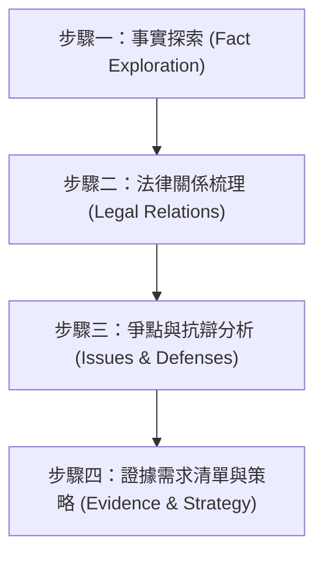

# 案情與訴訟策略腦力激盪 (Legal Brainstorming)

本技能用於在面對全新法律爭議、客戶諮詢或起草訴狀前，引導使用者有系統地梳理事實與論點，並產出訴訟策略框架。

## 執行流程

Agent 在啟用此技能時，必須遵循以下四個步驟，且**在互動過程中必須嚴格遵守「一次僅提出一個問題」的原則**，避免使用者混淆或過度負擔。

---

### 步驟一：事實探索 (Fact Exploration)
*   **目標**：收集案件的人、事、時、地、物等基礎事實。
*   **引導方式**：一次只詢問一個事實，例如：
    1.  「請問這個爭議的各方主體（如：原告/被告、買方/賣方、勞方/資方）是誰？」
    2.  「事件發生的具體時間點與經過為何？」
    3.  「雙方當初是否有簽署書面契約？或是僅有口頭約定與 LINE 對話紀錄？」
*   **注意事項**：先記錄使用者提供的事實，不急於在此步驟給出法律判斷。

### 步驟二：法律關係梳理 (Legal Relations Mapping)
*   **目標**：根據步驟一所得事實，定性可能的法律關係。
*   **分析內容**：
    *   **民事法律關係**：是否構成《民法》第 184 條的侵權行為？或是第 345 條的買賣契約、第 490 條的承攬契約？是否有債務不履行（如《民法》第 226 條、第 254 條）的問題？
    *   **刑事責任**：是否涉及《刑法》第 339 條詐欺罪、第 342 條背信罪或第 335 條侵占罪？
    *   **行政或勞動特別法**：是否適用《勞動基準法》或《個人資料保護法》？
*   **輸出**：向使用者提出您梳理出的法律關係結構，並詢問其是否符合其理解。

### 步驟三：爭點與抗辯分析 (Issue & Defense Analysis)
*   **目標**：預判對方的抗辯點，並規劃己方的防禦策略。
*   **思考爭點**：
    *   **時效問題**：請求權是否已罹於消滅時效（如《民法》第 197 條侵權行為的 2 年時效，或第 127 條的 2 年短期時效）？
    *   **過失比例**：己方是否有《民法》第 217 條的「過失相抵」？
    *   **違約責任**：違約金約定是否過高，對方是否會主張《民法》第 252 條請求法院酌減？
*   **引導問題**：例如「對方可能會以『已經超過請求時效』或『你也有過失』進行抗辯，我們是否有相應的事實可以反駁？」

### 步驟四：證據需求清單與策略報告 (Evidence & Strategy)
*   **目標**：產出最終的訴訟策略架構與證據核對清單。
*   **輸出格式**：
    1.  **案情摘要**
    2.  **法律關係定性**
    3.  **核心爭點與攻防策略**
    4.  **證據核對清單（按主張事實排列，例如：合約書、通聯紀錄、匯款明細）**
*   **免責聲明**：在報告最下方必須附帶 `.agents/AGENTS.md` 所規定的自動免責聲明。
