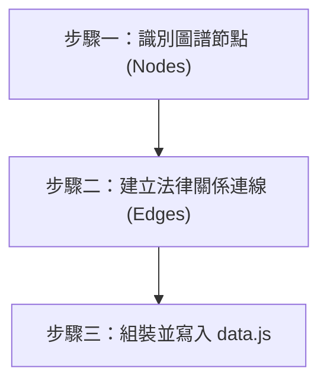

# 法律圖譜 Superset 資料生成技能 (Legal Graph Generator)

本技能用於規範與引導 AI 助理如何將梳理出的案件事實、法律關係、援引判決、爭點、當事人與關鍵證據，自動轉化為與本技能隨附渲染器（`renderer/index.html`／`renderer/data.js`）完全相容的 superset 標準資料格式，並寫入 `renderer/data.js`（`window.GRAPH_DATA`）供頁面自動載入渲染。渲染器已自包含 3D 函式庫，直接以瀏覽器開啟 `renderer/index.html` 即可。

## 執行流程

Agent 在被要求生成關聯圖或進行法律關係可視化分析時，必須遵循以下步驟：



---

### 步驟一：識別圖譜節點 (Nodes)

> **完整抽取方法論**：各維度應如何從既有技能產出中抽取資料（含 5 種法條關聯 `rel` 的判斷準則），請參閱 [references/superset-extraction.md](references/superset-extraction.md)。Agent 產圖時應本著「聯集精神」盡量抓齊下列所有維度，資料不足時才退回基本 4 類（見本節末尾之向後相容聲明）。

> **優先消費結構化資料**：若判例來自 `legal-research` 的 `dr-lawbot:search_bundle` 回傳，**優先讀取 bundle 的結構化欄位**建圖，而非僅從散文推斷：
> *   `cited_articles` → 逐條建立 `law` 節點，並以「引用」邊連該判決 → 法條。
> *   `case_history.upper`／`lower` → 以「上訴」邊連前後審判決；若審級紀錄顯示該判決「主文含廢棄」，於該 judgment 節點標記 `"overturned": true`（見本節第 3 點與步驟三範例）。
> *   `citation_text` → 作為 judgment 節點 label。
> *   僅引用 `allowed_citations` 內之判決建立 judgment 節點，避免幻覺引用。

從前述的 `legal-brainstorming`（事實分析）與 `legal-research`（法規判例檢索）結果中，識別出以下節點類型，並為每個節點分配一個唯一的 `id`，撰寫簡短的 `title` 與詳細的 `description`：

1.  **`fact` (案件事實)**：
    *   *定義*：案件的核心事實背景、時間、主體遭遇。
    *   *例如*：`"id": "fact_1", "label": "大安區車禍", "group": "fact"`。
2.  **`law` (法律條文)**：
    *   *定義*：所適用的具體法律條文。
    *   *例如*：`"id": "law_civ_184", "label": "民法第 184 條第 1 項", "group": "law"`。
3.  **`judgment` (法院判決)**：
    *   *定義*：作為論據支持或裁判參考的最高法院或各級法院判決、大法官解釋。
    *   *例如*：`"id": "jud_supreme_108_2345", "label": "最高法院 108 台上 2345 號", "group": "judgment"`。
    *   *可選欄位*：`status`（`good`／`bad`／`mixed`，代表本方於該判決之勝敗結果，決定節點配色）、`url`（判決全文連結）、`overturned`（布林值，`true` 表示該判決業經上級審廢棄、僅供審級關係參考；`index.html` 會將該節點改為灰底、紅色網線框，並在標籤末尾加註「⚠️已廢棄」，無此欄位者照常渲染）。
4.  **`issue` (爭點/訴訟主張)**：
    *   *定義*：雙方的爭執焦點（如時效消滅、請求酌減違約金），或具體的民事求償請求。
    *   *例如*：`"id": "claim_compensation", "label": "請求賠償 50 萬", "group": "issue"`。
5.  **`party` (被告方)**：
    *   *定義*：涉訟案件中的被告方主體（自然人或法人）。
    *   *例如*：`"id": "party_1", "label": "被告某某科技公司", "group": "party"`。
    *   *關聯方式*：以 **「當事人」** 連線連到其涉訟之 `judgment`（或 `fact`）節點。
6.  **`plaintiff` (原告方)**：
    *   *定義*：涉訟案件中的原告方主體。
    *   *例如*：`"id": "plaintiff_1", "label": "原告某甲", "group": "plaintiff"`。
    *   *關聯方式*：同 `party`，以 **「當事人」** 連線連到其涉訟之 `judgment`（或 `fact`）節點。
7.  **`evidence` (關鍵證據)**：
    *   *定義*：足以影響爭點認定或判決結果之關鍵證據。
    *   *例如*：`"id": "evi_1", "label": "監視器錄影畫面", "group": "evidence", "favorable": "strong", "description": "拍攝到被告闖紅燈之瞬間，證明力極強"`。
    *   *`favorable` 欄位*：`strong`（有利／證明力強）或 `weak`（不利／證明力弱）。
    *   *關聯方式*：以 **「證據」** 連線連到其所屬的 `judgment`（或 `fact`）節點。

**其他可選欄位**（任一節點皆可加註）：
*   **`family`**：案件分群標籤（如同一被告集團、同一系列產品訴訟），用於在 `index.html` 啟用「家族聚焦」視圖。

**向後相容聲明**：若手邊僅有基本資料，僅產出 `fact`／`law`／`judgment`／`issue` 四類節點與下列前 7 種連線（不含 `party`／`plaintiff`／`evidence`、「法條關聯」／「當事人」／「證據」連線及 `family` 欄位）亦可，`index.html` 仍可正常渲染舊格式圖譜；`judgment` 節點之 `status`／`url`／`overturned` 欄位在基本格式下亦可照常使用。

### 步驟二：建立法律關係連線 (Edges)
定義節點間的連線，連線的 `label` 必須精準符合以下類型，以便在 `index.html` 中正確觸發連線樣式分流：
*   **`"適用"`**：事實 ➔ 法條（例如：大安區車禍 適用 民法第 184 條）。
*   **`"引用"`**：判決 ➔ 法條，或判例之間的引用。
*   **`"刑事附帶民事 (民附)"`**：刑事判決 ➔ 民事求償主張（免裁判費之程序連結）。
*   **`"上訴"`**：前審判決 ➔ 後審判決（展示審級關係）。
*   **`"連帶責任/保證"`**：主體之間的連帶賠償關係。
*   **`"抗辯/阻斷"`**：消滅時效或過失相抵（爭點） ➔ 訴訟主張。
*   **`"保全/假扣押"`**：保全程序 ➔ 本案訴訟。
*   **`"法條關聯"`**：法條 ➔ 法條（`law` ↔ `law`），表示法條間的體系關係，須額外加註 `rel` 欄位（判斷準則詳見 [references/superset-extraction.md](references/superset-extraction.md)）：
    *   `trigger`：構成要件成立 → 引發特定法律效果。
    *   `alt`：備位主張或得擇一適用。
    *   `absorb`：法條競合，重法或特別規定吸收輕法或普通規定。
    *   `lex`：特別法優於普通法。
    *   `bridge`：請求權罹於時效後，銜接至另一請求權基礎（如轉主張不當得利）。
    *   `title` 欄位應簡述兩法條間的具體關係。
*   **`"當事人"`**：`party` 或 `plaintiff` ➔ `judgment`（或 `fact`），表示該當事人涉訟於此案件／事實。
*   **`"證據"`**：`judgment` 或 `fact` ➔ `evidence`，表示該證據為該案的關鍵證據。

### 步驟三：組裝並寫入 data.js
Agent 必須先以下方的 ` ```json ` 格式在內部組裝 `{nodes, edges}` 資料，且**禁止在 JSON 中加入任何註解（如 `//` 或 `/* */`）**，確保其符合標準 JSON 規格：

```json
{
  "nodes": [
    { "id": "fact_id", "label": "節點標題", "group": "fact", "title": "滑鼠懸停簡述", "description": "詳細描述原文（支持 Markdown）" },
    { "id": "law_id", "label": "法條名稱", "group": "law", "title": "滑鼠懸停簡述", "description": "法條原文或摘要" },
    { "id": "jud_id", "label": "判決字號", "group": "judgment", "title": "滑鼠懸停簡述", "description": "判決要旨", "status": "good", "url": "https://判決全文連結", "family": "案件家族名稱" },
    { "id": "issue_id", "label": "爭點標題", "group": "issue", "title": "滑鼠懸停簡述", "description": "爭點說明" },
    { "id": "party_id", "label": "被告名稱", "group": "party", "family": "案件家族名稱" },
    { "id": "plaintiff_id", "label": "原告名稱", "group": "plaintiff" },
    { "id": "evi_id", "label": "證據名稱", "group": "evidence", "title": "滑鼠懸停簡述", "description": "證明力說明", "favorable": "strong" }
  ],
  "edges": [
    { "from": "from_id", "to": "to_id", "label": "關係類別", "title": "關係的具體法律說明" },
    { "from": "law_id", "to": "law_id_2", "label": "法條關聯", "title": "兩法條間的體系關係說明", "rel": "trigger" },
    { "from": "party_id", "to": "jud_id", "label": "當事人" },
    { "from": "jud_id", "to": "evi_id", "label": "證據" }
  ]
}
```

*   **廢棄旗標（可選）**：當某 `judgment` 節點對應的判決 `case_history` 顯示已被上級審廢棄（「主文含廢棄」）時，於該節點加布林欄位 `"overturned": true`。`index.html` 會將其標示為灰底、紅色網線框，並於標籤末尾加註「⚠️已廢棄」；無此欄位者照常渲染。範例：

```json
{ "id": "jud_x", "label": "臺灣XX地方法院 108 年度上字第 1 號（已廢棄）", "group": "judgment", "overturned": true, "title": "本判決業經上級審廢棄，僅供審級關係參考" }
```

*   **輸出後的動作與提示語**：
    組裝完成後，Agent **不再**輸出供貼上的 JSON 文字框流程，而是直接將 `{nodes, edges}` 寫入（新建或更新）本技能之 `renderer/data.js` 檔案，格式為 `window.GRAPH_DATA = { "nodes": [...], "edges": [...] };`。寫入後必須提示使用者：
    > 「已將 `{nodes, edges}` 寫進本技能 `renderer/data.js` 的 `window.GRAPH_DATA`，以瀏覽器開啟 `renderer/index.html` 會自動讀取渲染；更新案件只需編輯 `renderer/data.js`。」
